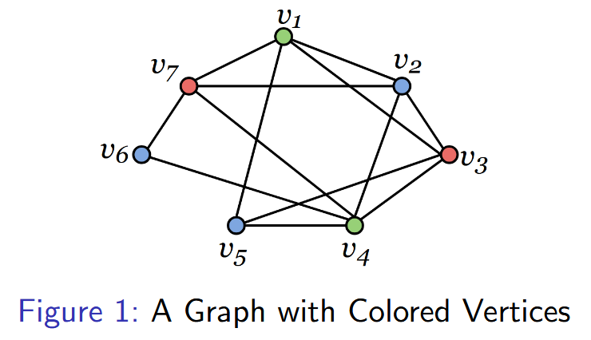

# Graph Coloring

Graph coloring, also called vertex coloring, involves assigning colors to the vertices
of a graph where **adjacent vertices must have different colors**. This has applications in 
scheduling and routing problems, resource allocation, computer networking, and machine learning.

> **Tags:** Theory
  
---

## Graph Colorings

A proper coloring (or, more simply, a **coloring** ) of a graph
_G_, is an assignment of colors (elements of some set) to the vertices of _G_,
one color to each vertex, such that adjacent vertices are colored differently.
A coloring using _k_-colors is called a **_k_-coloring**.

