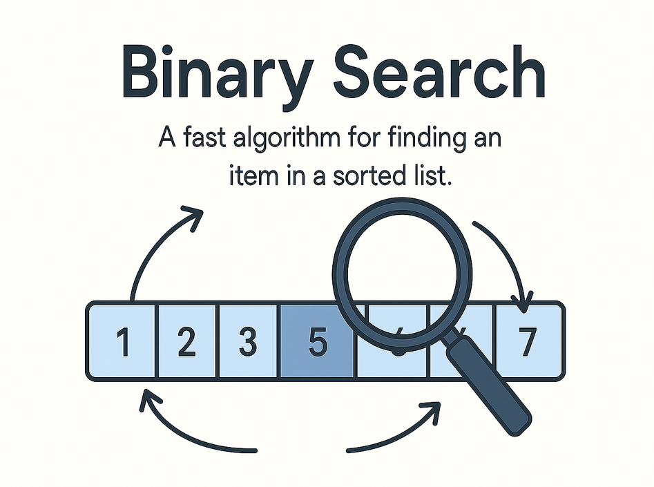

# Binary Search Explained
_Written by ChatGPT_

Binary Search is one of the most efficient and fundamental algorithms in computer science. It allows you to **find an item in a sorted list in logarithmic time**, which is a major speedup over linear search.

> **Tags:** DSA, Theory

---

[](../media/article_images/binary_search_prev.png)

---

## What Is Binary Search?

Binary Search works by **repeatedly dividing a sorted list in half** and narrowing down the search range. It compares the middle element of the current range with the target, eliminating half the elements each time.

This is only possible if the list is **sorted**.

---

## Real-World Analogy

Imagine looking up a word in a dictionary:

1. You open to the middle.
2. If the word you're looking for comes before the middle page, flip to the first half.
3. Otherwise, flip to the second half.
4. Repeat until you find the word.

That's Binary Search.

---

## Pseudocode

```
def binary_search(arr, target):
    low = 0
    high = len(arr) - 1

    while low <= high:
        mid = (low + high) // 2
        guess = arr[mid]

        if guess == target:
            return mid
        elif guess < target:
            low = mid + 1
        else:
            high = mid - 1

    return -1  # not found
```

---

## Time Complexity

| Case        | Time       |
|-------------|------------|
| Best        | `O(1)`     |
| Average     | `O(log n)` |
| Worst       | `O(log n)` |

Binary Search cuts the problem size in half each time, which gives it its logarithmic efficiency.

---

## Binary Search Conditions

✅ List must be **sorted**  
✅ You must be able to **compare elements**  
✅ Works on arrays, strings, or any range-based structure

---

## When Not to Use It

- If the list is unsorted
- If insertions/deletions happen frequently (sorting overhead)
- When list size is very small (`O(n)` may be faster in practice)

---

## Applications

- Finding elements in sorted arrays
- Lower/upper bound problems
- Search problems on number ranges (e.g. finding min/max valid value)
- Implicit binary search on monotonic functions

---

## Summary

Binary Search is a powerful, efficient technique that dramatically reduces search time when applied to sorted data. It’s a cornerstone of algorithmic problem-solving — understanding it is essential for any aspiring programmer or computer scientist.

---

_Happy searching!_
